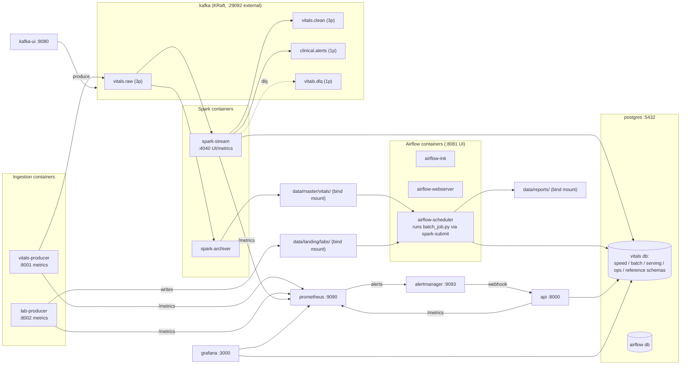

# Architecture Diagrams

Two diagrams, per the report requirement: (1) the layered Lambda view, and (2) the
concrete component/deployment view (containers, topics, tables, ports).

Both are Mermaid, which renders natively on GitHub, in VS Code's Markdown preview, and
in most Markdown-aware tools. For the submitted PDF report, render this file (GitHub
preview, the VS Code Mermaid extension, or paste the source into
[mermaid.live](https://mermaid.live)) and paste the resulting image in — don't screenshot
this raw file.

## 1. Layered Lambda view

```mermaid
flowchart TB
    subgraph sources["Data Sources"]
        VP["Bedside monitors<br/>(vitals_producer.py)<br/>every 2s per patient"]
        LP["Pathology lab<br/>(lab_batch_producer.py)<br/>once per sim day"]
    end

    subgraph speed["SPEED LAYER — near-real-time"]
        direction TB
        K1["Kafka: vitals.raw<br/>(3 partitions, keyed by patient_id)"]
        SJ["stream_job.py<br/>clean → dedup (watermark) →<br/>1min/30s windows → NEWS2 score →<br/>sustained-alert detection"]
        ST1[("speed.vitals_clean<br/>speed.patient_vitals_1m<br/>speed.patient_risk_now<br/>speed.clinical_alerts")]
        K1 --> SJ --> ST1
    end

    subgraph batch["BATCH LAYER — authoritative daily recompute"]
        direction TB
        AR["raw_archiver.py<br/>(separate Structured Streaming job)"]
        MD[("MASTER DATASET<br/>Parquet, partitioned dt=/hour=<br/>data/master/vitals/")]
        LF["data/landing/labs/<br/>labs_&#123;sim_day&#125;.csv"]
        AF["Airflow DAG: daily_patient_risk<br/>wait → validate → batch_job.py"]
        BJ["batch_job.py<br/>worst-of-day NEWS2 (max_by) →<br/>5 lab DQ rules + quarantine →<br/>THE JOIN: adjust_risk_with_labs()"]
        BT[("batch.patient_daily_vitals<br/>batch.patient_lab_results<br/>batch.patient_risk_daily")]
        K1 --> AR --> MD
        MD --> BJ
        LF --> AF --> BJ
        BJ --> BT
    end

    subgraph serving["SERVING LAYER"]
        direction TB
        MV[("serving.patient_360<br/>materialized view<br/>(merges speed.* NOW with batch.* YESTERDAY)")]
        API["FastAPI (serving/api.py)"]
        GRAF["Grafana dashboards"]
        REP["Daily HTML/CSV report<br/>(report_builder.py)"]
        ST1 -.-> MV
        BT -.-> MV
        MV --> API
        MV --> GRAF
        BT --> REP
    end

    VP --> K1
    LP --> LF

    CLINICAL["common/clinical.py<br/>SHARED scoring logic<br/>(imported by BOTH SJ and BJ —<br/>one implementation, two execution contexts)"]
    CLINICAL -.-> SJ
    CLINICAL -.-> BJ

    style CLINICAL fill:#fff4d6,stroke:#c9971e
    style MV fill:#e6f6e6,stroke:#2e7d32
```

## 2. Concrete component / deployment view

